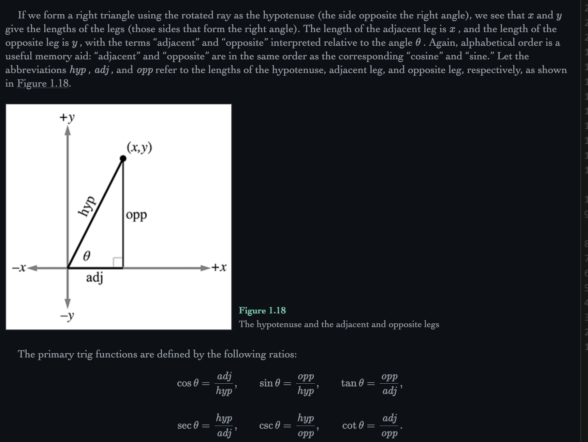

# 3d Math

## Cartesian Coordinate Systems

Left handed cartesian system: (Used by unity)
- +z is towards middle, +y is up, +x is RIGHT
- Positive rotation is clockwise

Right handed cartesian system:
- +z is towards middle, +y is up, +x is LEFT 
- Rotation: positive rotation is anti-clockwise

## Trig

Degrees is measuring rotation by a revolution around 360 units that forma circle.

Radians measure the length of the intercepted arc of a unit circle. A full unit circle's radian is 2*pi (2*pi*r circumference).

360 degrees = 2 * pi radians
1 degree = (2 * pi) / 360 => pi / 180
1 radian = 180 / pi


cos(theta) = x
sin(theta) = y



Negating a vector results in a vector of the same magnitude but opposite direction

Geometrically, multiplying a vector by a scalar k
has the effect of scaling the length by a factor of |k|

## Model View Projection Matrices
This is literally the only thing that matters lmao... everything else is kinda details, this is the overarching principle that makes 3d possible.

### High level process — why does this make 3d possible

The screen is 2d. All "3d rendering" is really: take points defined in 3d space and figure out where they land on a 2d screen, in a way that respects perspective (far things look smaller). MVP is the pipeline of coordinate-space transforms that does exactly that.

Every vertex of every mesh starts in **model space** (aka object/local space): coordinates relative to the model's own origin (e.g. a character's origin between its feet). To get it onto the screen it passes through a chain of spaces:

```
model space --(Model matrix)--> world space --(View matrix)--> view/camera space --(Projection matrix)--> clip space --(perspective divide)--> NDC --(viewport transform)--> screen pixels
```

- **Model matrix (M):** places the object in the world. It bakes together the object's translation, rotation, and scale. Two instances of the same mesh = same vertices, two different model matrices.
- **View matrix (V):** re-expresses the world relative to the camera, so the camera sits at the origin looking down an axis (-z in OpenGL convention, +z in DirectX). There is no "camera" really — you move the entire world inversely to the camera. V is just the inverse of the camera's own world transform.
- **Projection matrix (P):** squishes the camera's viewing volume (a frustum for perspective, a box for orthographic) into a canonical cube, and — the key trick — sets things up so that x and y get divided by depth. That division by z IS perspective: farther points get pulled toward the center of the screen, so they look smaller. This is the single step that makes an image read as "3d".

After projection you're in **clip space** (4d homogeneous coords). The GPU divides x, y, z by w (the **perspective divide**) to get **normalized device coordinates** (NDC, everything in [-1,1], or [0,1] for z in DirectX), then maps that to actual pixel coordinates (viewport transform).

Since matrix multiplication composes, the whole chain collapses into one matrix computed once per object per frame:

```
v_clip = P * V * M * v_model     (column-vector convention; reads right-to-left)
```

One 4x4 matrix multiply per vertex and the entire 3d illusion falls out. That's why this is the only thing that matters.

### The math

Everything is 4x4 matrices acting on **homogeneous coordinates**: a point (x, y, z) becomes (x, y, z, 1). The extra w component exists for two reasons:
1. Translation is not a linear operation in 3d (it's affine), but it IS linear in 4d — the 4th column of the matrix holds the translation and it gets picked up by w=1.
2. It gives projection somewhere to stash depth so the perspective divide can happen later. Directions/vectors use w=0 so translation doesn't affect them.

**Model matrix** — composed as translation * rotation * scale (scale first, then rotate, then move — order matters, matrix mult is not commutative):

```
        [ Sx 0  0  0 ]        [ 1 0 0 Tx ]
S =     [ 0  Sy 0  0 ]   T =  [ 0 1 0 Ty ]   R = 3x3 rotation in upper-left
        [ 0  0  Sz 0 ]        [ 0 0 1 Tz ]
        [ 0  0  0  1 ]        [ 0 0 0 1  ]

M = T * R * S
```

Rotation about z by theta (others are cyclic permutations):

```
      [ cos(t) -sin(t) 0 0 ]
Rz =  [ sin(t)  cos(t) 0 0 ]
      [ 0       0      1 0 ]
      [ 0       0      0 1 ]
```

(this is just the cos/sin unit-circle stuff from the Trig section, applied per axis)

**View matrix** — build the camera's world transform from eye position + look direction ("look-at"), then invert it. Given eye position E, target, and world up:

```
forward f = normalize(target - E)
right   r = normalize(cross(f, up))
up      u = cross(r, f)
```

r, u, f form an orthonormal basis, so the inverse is cheap: transpose the rotation part, and the translation becomes the negated dot products:

```
      [ r.x  r.y  r.z  -dot(r, E) ]
V =   [ u.x  u.y  u.z  -dot(u, E) ]
      [-f.x -f.y -f.z   dot(f, E) ]      (negated f row = OpenGL looking down -z)
      [ 0    0    0     1         ]
```

**Perspective projection matrix** — parameterized by vertical field of view, aspect ratio, and near/far clip planes. With t = tan(fovY / 2):

```
      [ 1/(aspect*t)  0     0            0              ]
P =   [ 0             1/t   0            0              ]
      [ 0             0    -(f+n)/(f-n) -2fn/(f-n)      ]
      [ 0             0    -1            0              ]
```

The load-bearing row is the last one: `w_clip = -z_view`. So after the GPU does the perspective divide (x/w, y/w, z/w), x and y have effectively been divided by the view-space depth. Similar triangles: a point twice as far away projects half as far from screen center. The weird z row exists to remap depth into the canonical range non-linearly while keeping it divide-compatible — this is also why depth buffer precision is mostly spent near the near plane (never set near absurdly small).

Orthographic projection is the boring cousin: just scale+translate the box into the cube, w stays 1, no divide, no foreshortening — used for 2d/UI/shadow maps.

**Normals gotcha:** normals don't transform by M — non-uniform scale skews them. They transform by the inverse-transpose of M's upper 3x3.

### What runs on CPU vs GPU

**CPU (per frame, per object — cheap, small data):**
- Build M from each object's transform (scene graph / physics / animation output)
- Build V from the camera, P from fov/aspect (P basically only changes on resize)
- Usually pre-multiply MVP = P * V * M once per object (3 matrix-matrix mults, ~nothing) and upload it to the GPU as a uniform/constant buffer
- Frustum culling: skip objects whose bounding volume is entirely outside the view frustum — no point paying vertex cost for them

**GPU:**
- **Vertex shader:** the per-vertex work — `gl_Position = MVP * vec4(position, 1.0)`. This is THE reason GPUs exist: millions of vertices, each an independent 4x4 * vec4 multiply, embarrassingly parallel.
- **Fixed function (you don't write this):** clipping against the frustum, perspective divide, viewport transform, rasterization, depth test. Also perspective-correct interpolation of vertex attributes (UVs etc.) across triangles — which relies on that same w.

Rule of thumb: anything per-OBJECT (a handful of matrices) is fine on the CPU; anything per-VERTEX or per-PIXEL belongs on the GPU. The MVP matrix is the handoff point — CPU composes it once, GPU applies it a million times. (GPU skinning/instancing push even more of the M construction onto the GPU by passing bone matrices or per-instance transforms in buffers.)